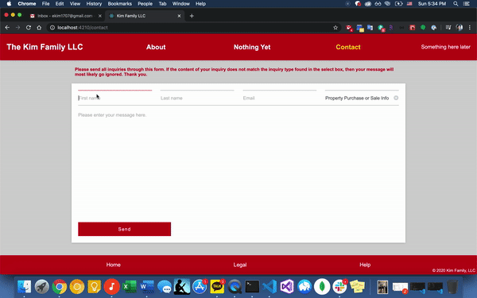

# The Kim Family LLC Website 
## Specializing in investment and management of commercial and real-estate properties

Video: https://youtu.be/fCcHIh1t2ik

## Example of what the website looks like...

Contact form including working validiation:

## Description

Very simple CRA front-end app hosted statically on AWS EC2.
Backend will not be used for now.

The least amount of npm packages possible were used to create this app. That is the way I personally prefer to do things. That being said, emailjs seems like a pretty awesome one so far, that works well and is easy to use, and customer support seemed to be very kind.

Any other questions regarding the code, feel free to reach out at any time.

Thanks.

## Contributors 
* Eugene Kim: https://github.com/ekim1707 
